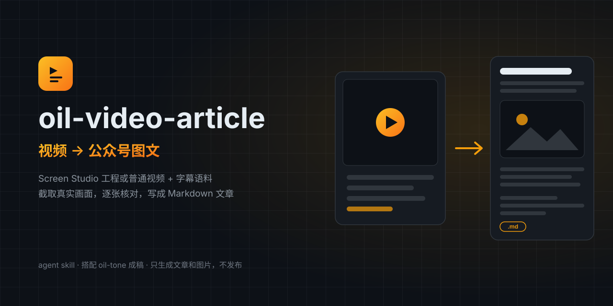

# oil-video-article



将录屏工程或普通视频及其字幕整理为公众号 Markdown 文章，并提取可核对的真实配图。

## 两种输入

- **Screen Studio 工程**：配图从没有头像、没有缩放包装的纯屏幕录制轨道（`channel-*-display-*.mp4`）截取，时间轴经 `project.json` 的 slices 映射回 source 时间，支持导出后又有剪辑的错位校正。
- **普通视频**（mp4/mov）：字幕时间就是视频时间，直接从视频本身截帧。

两种输入都需要字幕语料（`.srt` / `.ass`）。没有字幕时先用 [oil-subtitle](https://github.com/oil-oil/oil-subtitle) 生成。

## 安装

```bash
git clone https://github.com/oil-oil/oil-video-article ~/.agents/skills/oil-video-article
```

`~/.claude/skills/`、`~/.codex/skills/` 等你的 agent 实际扫描的 skill 目录也可以。

依赖：`python3`、`ffmpeg` / `ffprobe`。

## 使用

把工程目录或视频文件连同字幕交给 agent 即可，例如：

> 把 `~/Movies/视频项目/2026-08-13_示例/` 这一期整理成公众号文章。

agent 会按 `SKILL.md` 的流程执行：读字幕分段 → （工程模式）检查时间轴一致性 → 截配图 → 逐张核对 → 补全可复制的原始命令和链接 → 按 [oil-tone](https://github.com/oil-oil/oil-tone) 的规则成稿 → 输出到 `<视频目录>/公众号文章/`。

## License

[MIT](LICENSE)

## 配置、依赖与使用边界

需要本地视频处理工具、可用字幕材料及 Skill 中指定的 Gemini 入口；文章语气使用 oil-tone。外部模型凭据通过对应工具的配置入口管理。

视频、字幕或抽帧可能发给外部模型。等时长不代表等时间轴；无法证明映射时直接从最终视频取帧。发布文章是独立动作。

使用示例：

```text
把这个视频整理成公众号文章，配图使用视频中的真实操作画面。
```

## GitHub 安装

把 [仓库地址](https://github.com/oil-oil/oil-video-article) 交给 Agent，要求按 README 安装；也可运行：

```bash
npx skills add oil-oil/oil-video-article
```

安装后由宿主重新加载 Skill。
